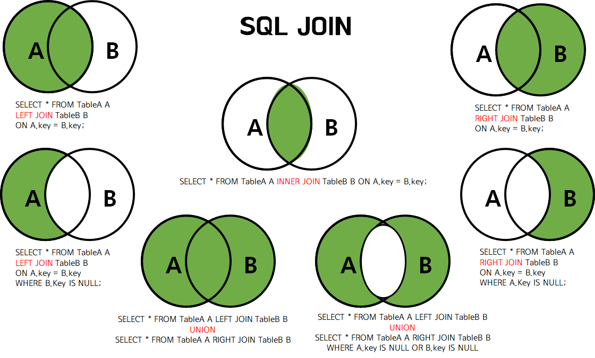

# SQL - Join

## À quoi servent les JOIN&#x20;

En SQL, les données sont souvent réparties dans plusieurs tables liées entre elles.

Un JOIN permet de croiser ces tables pour combiner les données liées par une colonne commune.

***

### Tables utilisées pour les exemples

utilsiateurs

| id | nom   | pays\_id |
| -- | ----- | -------- |
| 1  | Alice | 1        |
| 2  | Bob   | 2        |
| 3  | Clara | 1        |
| 4  | David | 3        |
| 5  | Emma  | NULL     |

pays

| id | nom\_pays |
| -- | --------- |
| 1  | France    |
| 2  | Belgique  |
| 3  | Canada    |
| 4  | Suisse    |

***

### 1. INNER JOIN

&#x20;(jointure interne)

> Ne garde que les lignes ayant une correspondance dans les deux tables

Objectif : afficher les utilisateurs avec leur pays

```sql
SELECT utilisateurs.nom, pays.nom_pays
FROM utilisateurs
INNER JOIN pays ON utilisateurs.pays_id = pays.id;
```

Résultat :

| nom   | nom\_pays |
| ----- | --------- |
| Alice | France    |
| Bob   | Belgique  |
| Clara | France    |
| David | Canada    |

Emma n’apparaît pas car elle n’a pas de pays (pays\_id = NULL)

***

### 2. LEFT JOIN

&#x20;(jointure externe gauche)

> Garde tous les utilisateurs, même ceux sans pays associé

```sql
SELECT utilisateurs.nom, pays.nom_pays
FROM utilisateurs
LEFT JOIN pays ON utilisateurs.pays_id = pays.id;
```

Résultat :

| nom   | nom\_pays |
| ----- | --------- |
| Alice | France    |
| Bob   | Belgique  |
| Clara | France    |
| David | Canada    |
| Emma  | NULL      |

Emma est bien incluse, mais nom\_pays est NULL

***

### 3. RIGHT JOIN

&#x20;(jointure externe droite)

> Garde tous les pays, même ceux sans utilisateur associé

```sql
SELECT utilisateurs.nom, pays.nom_pays
FROM utilisateurs
RIGHT JOIN pays ON utilisateurs.pays_id = pays.id;
```

Résultat :

| nom   | nom\_pays |
| ----- | --------- |
| Alice | France    |
| Bob   | Belgique  |
| Clara | France    |
| David | Canada    |
| NULL  | Suisse    |

Suisse apparaît alors qu’aucun utilisateur n’y est associé

***

### 4. FULL OUTER JOIN

&#x20;(jointure externe complète)

> Garde tout, même les lignes sans correspondance des deux côtés

_Pas toujours supporté nativement (ex. : pas en MySQL), mais dispo en PostgreSQL._

```sql
SELECT utilisateurs.nom, pays.nom_pays
FROM utilisateurs
FULL OUTER JOIN pays ON utilisateurs.pays_id = pays.id;
```

Résultat :

| nom   | nom\_pays |
| ----- | --------- |
| Alice | France    |
| Bob   | Belgique  |
| Clara | France    |
| David | Canada    |
| Emma  | NULL      |
| NULL  | Suisse    |

***

### 5. Jointures avec alias

Utiliser des alias pour simplifier la syntaxe :

```sql
SELECT u.nom, p.nom_pays
FROM utilisateurs u
LEFT JOIN pays p ON u.pays_id = p.id;
```

***

### 6.  JOIN avec conditions supplémentaires

Tu peux combiner le JOIN avec un WHERE :

```sql
SELECT u.nom, p.nom_pays
FROM utilisateurs u
LEFT JOIN pays p ON u.pays_id = p.id
WHERE p.nom_pays = 'France';
```

Résultat :

| nom   | nom\_pays |
| ----- | --------- |
| Alice | France    |
| Clara | France    |

***

### 7. Résumé visuel

| Type de JOIN    | Ce qu’il affiche                                                |
| --------------- | --------------------------------------------------------------- |
| INNER JOIN      | Uniquement les lignes présentes dans les deux tables            |
| LEFT JOIN       | Toutes les lignes de gauche + correspondances à droite          |
| RIGHT JOIN      | Toutes les lignes de droite + correspondances à gauche          |
| FULL OUTER JOIN | Toutes les lignes des deux tables (avec ou sans correspondance) |

<figure><figcaption></figcaption></figure>
